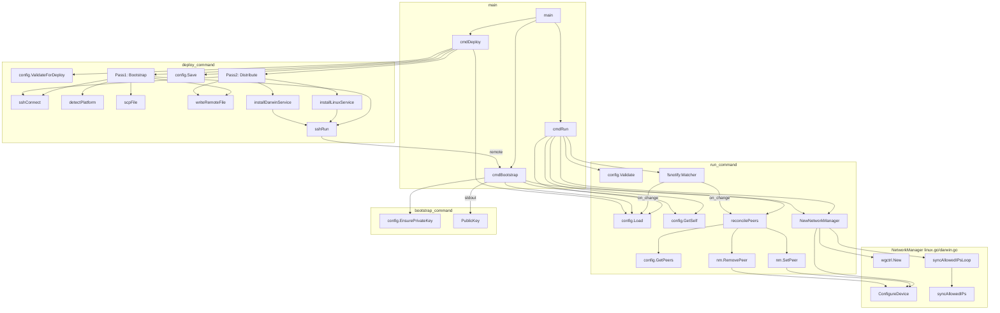
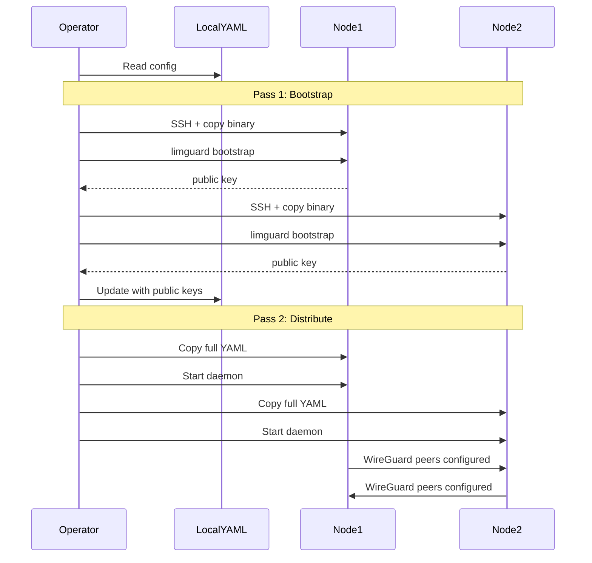

# limguard

WireGuard mesh network daemon. Single YAML config used for both deployment and runtime.

## Files

- `cmd/main.go` - CLI: run, bootstrap, deploy commands
- `config/config.go` - YAML config loading/validation
- `linux.go` / `darwin.go` - Platform-specific WireGuard management

## Call Flow

## Deploy Sequence

