# limguard

WireGuard mesh network daemon. Single YAML config used for both deployment and runtime.

## Files

- `cmd/limguard/main.go` - CLI entrypoint (thin wrapper)
- `config.go` - YAML config loading/validation, constants
- `version.go` - Version variable (set at build time)
- `run.go` - Run command: daemon lifecycle, config watching, peer reconciliation
- `deploy.go` - Apply command: SSH/SFTP helpers, service installation
- `linux.go` / `darwin.go` - Platform-specific WireGuard NetworkManager

## Call Flow

```mermaid
flowchart TD
    subgraph main[cmd/limguard/main.go]
        M[main] --> limguard.Run
        M --> limguard.Apply
    end

    subgraph run_command[Run - run.go]
        limguard.Run --> LoadConfig
        limguard.Run --> Config.Validate
        limguard.Run --> Config.GetSelf
        limguard.Run --> EnsurePrivateKey
        EnsurePrivateKey -->|writes| PubkeyFile[privatekey.pub]
        limguard.Run --> verifyPubkey[verify self pubkey matches]
        limguard.Run --> NewNetworkManager
        limguard.Run --> reconcilePeers
        limguard.Run --> fsnotify[fsnotify.Watcher]
        fsnotify -->|on_change| LoadConfig
        fsnotify -->|on_change| reconcilePeers
        reconcilePeers --> Config.GetPeers
        reconcilePeers -->|skip if no pubkey| nm.SetPeer
        reconcilePeers --> nm.RemovePeer
    end

    subgraph apply_command[Apply - deploy.go]
        limguard.Apply --> LoadConfig
        limguard.Apply --> Config.ValidateForDeploy

        limguard.Apply --> Pass1[Pass1: Start services]
        Pass1 --> sshConnect
        Pass1 --> detectPlatform
        Pass1 --> fileSHA256[SHA256 hash check]
        fileSHA256 -->|if changed| sftpCopyFile
        Pass1 --> sftpWriteFile
        Pass1 --> installLinuxService
        Pass1 --> installDarwinService
        Pass1 --> waitForPubkey
        waitForPubkey -->|reads| PubkeyFile

        limguard.Apply --> Config.Save
        
        limguard.Apply --> Pass2[Pass2: Distribute and restart]
        Pass2 --> sftpWriteFile
        Pass2 --> runAsRoot[runAsRoot - stdin piped]
    end

    subgraph network_manager[NetworkManager linux.go/darwin.go]
        NewNetworkManager --> wgctrl.New
        NewNetworkManager --> ConfigureDevice
        nm.SetPeer --> ConfigureDevice
        nm.RemovePeer --> ConfigureDevice
        NewNetworkManager --> syncAllowedIPsLoop
        syncAllowedIPsLoop --> syncAllowedIPs
        nm.Close --> wgClient.Close
    end
```

## Deploy Sequence

